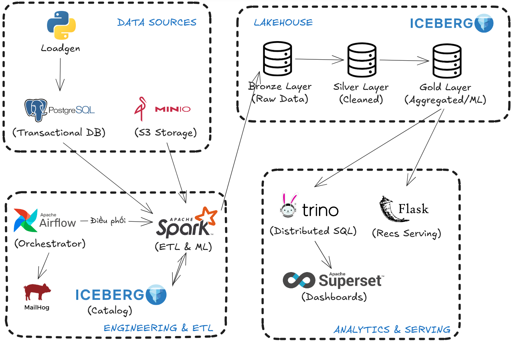
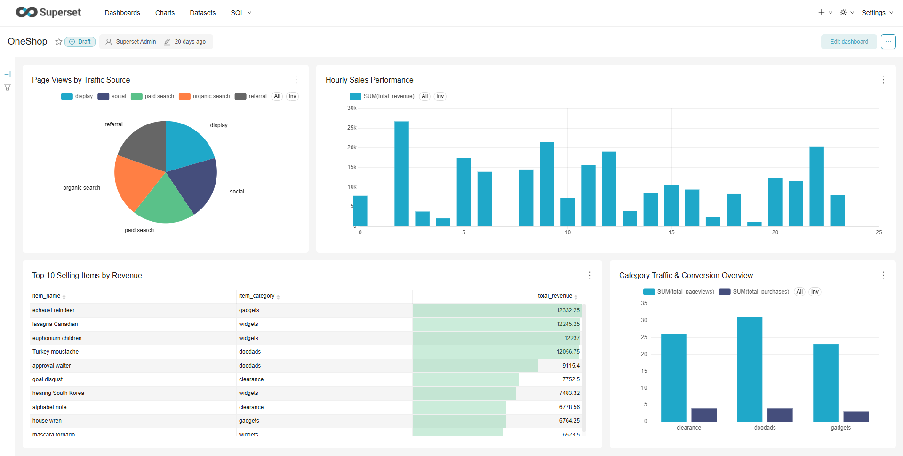

# Data Engineering Lakehouse - E-commerce Analytics Platform

A comprehensive **modern data lakehouse** built on Apache Iceberg, Apache Spark, and Trino for e-commerce analytics, feature engineering, and machine learning-based product recommendations.

## 📋 Table of Contents

- [Overview](#overview)
- [Architecture](#architecture)
- [Components](#components)
- [Prerequisites](#prerequisites)
- [Quick Start](#quick-start)
- [Project Structure](#project-structure)
- [Data Pipeline](#data-pipeline)
- [Modules](#modules)
- [Usage Examples](#usage-examples)
- [Analytics & Dashboards](#analytics--dashboards)
- [Configuration & Customization](#configuration--customization)
- [Troubleshooting](#troubleshooting)
- [Performance Tips](#performance-tips)

---

## Overview

This project demonstrates a **production-grade data engineering architecture** for an e-commerce platform. It features:

✨ **Key Capabilities:**
- **Real-time data generation** via LoadGen simulating user behavior (10,000 users, 1,000 items)
- **Multi-layer data lakehouse** (Bronze → Silver → Gold) for progressive data refinement
- **Apache Iceberg** for ACID transactions and schema evolution
- **Apache Spark** for distributed ETL and feature engineering
- **Trino SQL** for interactive analytics on the data lake
- **Machine Learning** - ALS (Alternating Least Squares) collaborative filtering for product recommendations
- **REST API** for consuming model predictions
- **Orchestration** with Apache Airflow for workflow automation
- **Data Visualization** with Apache Superset for business intelligence

---

## Architecture



---

## Components

| Component | Purpose | Port(s) |
|-----------|---------|---------|
| **PostgreSQL** | Source database for users, items, purchases | 5432 |
| **MinIO** | S3-compatible object storage for pageviews data | 9000, 9001 |
| **Apache Spark** | Distributed data processing & ML | 8080, 10000-10001 |
| **Iceberg REST** | Metadata management for Iceberg tables | 8181 |
| **Trino** | Distributed SQL query engine | 8443 |
| **LoadGen** | Synthetic data generator | - |
| **Flask API** | REST service for recommendations | 5050 |
| **Apache Airflow** | Workflow orchestration | 8081 |
| **Superset** | BI & visualization dashboard | 8088 |
| **Jupyter Notebook** | Development environment | 8888 |

---

## Prerequisites

- **Docker & Docker Compose** (v20.10+)
- **Linux/macOS** (Windows with WSL2 recommended)
- **Disk space**: ~20GB for all containers and data
- **Memory**: Minimum 8GB RAM allocated to Docker

---

## Quick Start

### 1. Clone and Setup

```bash
git clone https://github.com/thien-do-nguyen/Ecommerce-Lakehouse-Platform.git
cd Ecommerce-Lakehouse-Platform
docker compose up -d
```

Wait for all services to be healthy (~2-3 minutes):
```bash
docker compose ps
```

### 2. Initialize the Lakehouse

```bash
./lakehouse-preparer.sh
```

This script:
- Creates Iceberg table schemas
- Loads data from PostgreSQL (Bronze layer)
- Loads pageviews from MinIO (Bronze layer)
- Applies transformations (Silver layer)
- Creates analytics tables (Gold layer)
- Trains the ALS recommendation model

### 3. Start Apache Airflow (Optional)

To enable workflow orchestration and scheduling:
```bash
docker compose -f airflow.yaml up -d
```

Access Airflow UI at: **http://localhost:8081**

⚠️ **Important:** Airflow **must connect to the same network** as the main Docker Compose services (postgres, spark, trino, minio, etc.). Ensure your `airflow.yaml` includes the network configuration:

```yaml
networks:
  iceberg_net:
    external: true
    name: data-engineer_iceberg_net   #⚠️
```

This allows Airflow containers to communicate with other services. The network name should match the one created by `docker compose up -d` (default is `<folder>_iceberg_net`).

### 4. Explore the Data

#### Via Trino SQL:
```bash
docker compose exec trino trino

-- List tables
SHOW SCHEMAS;
SHOW TABLES FROM iceberg.gold;

-- Query recommendations
SELECT * FROM iceberg.gold.top_selling_items LIMIT 10;
```

#### Via Jupyter Notebook:
```
http://localhost:8888
# Token printed in compose logs
```

#### Via Superset Dashboard:
```
http://localhost:8088
# Username: admin
# Password: admin
```

### 4. Get Recommendations (Flask API)

```bash
curl http://localhost:5050/recommend/50
```

Response:
```json
{
  "recommendations": [
    {
      "item_id": 3,
      "score": 0.06083555
    },
    {
      "item_id": 28,
      "score": 0.05925211
    },
    {
      "item_id": 18,
      "score": 0.05611107
    },
    {
      "item_id": 197,
      "score": 0.051636543
    }
  ],
  "user_id": 50
}
```

---

## Project Structure

```
.
├── README.md                          # This file
├── docker-compose.yaml                # Service orchestration
├── lakehouse-preparer.sh              # Initialization script
├── iceberg-schema-gold.sql            # Gold layer DDL
├── airflow.yaml                       # Airflow configuration
│
├── airflow/                           # Workflow Orchestration
│   ├── Dockerfile
│   ├── dags/
│   │   └── user_engagement_segments_dag.py
│   └── dags/sql/
│       └── trino.sql
│
├── spark/                             # Data Processing Engine
│   ├── scripts/
│   │   ├── postgres_loader.py         # Bronze: Load from PostgreSQL
│   │   ├── minio_loader.py            # Bronze: Load from MinIO
│   │   ├── bronze_to_silver_transformer.py  # Silver: Data cleaning & enrichment
│   │   ├── compute_features.py        # Gold: Feature engineering
│   │   └── train_and_serve_als.py     # ML: Train recommendation model
│   └── notebooks/
│
├── postgres/                          # Source Database
│   ├── Dockerfile
│   └── postgres_bootstrap.sql         # Schema & seed data
│
├── loadgen/                           # Synthetic Data Generator
│   ├── Dockerfile
│   ├── generate_load.py               # Generates users, items, purchases, pageviews
│   └── requirements.txt
│
├── flask/                             # Recommendation API
│   ├── Dockerfile
│   ├── app.py                         # Flask REST endpoints
│   └── requirements.txt
│
├── trino/                             # SQL Query Engine
│   └── etc/
│       ├── config.properties
│       ├── jvm.config
│       ├── node.properties
│       └── catalog/
│           └── iceberg.properties
│
├── superset/                          # Analytics Dashboard
│   ├── Dockerfile
│   ├── superset_home/
│   └── superset_db_data/
│
├── notebooks/                         # Development & Analysis
│   ├── create_iceberg_tables.ipynb
│   └── spark-warehouse/
│
└── jars/                              # JDBC drivers & libraries
    ├── postgresql-42.7.6.jar
    ├── hadoop-aws-3.3.4.jar
    └── aws-java-sdk-bundle-1.11.1026.jar
```

---

## Data Pipeline

### Phase 1: Data Generation (LoadGen)

Generates synthetic e-commerce events continuously:

| Table | Records | Frequency |
|-------|---------|-----------|
| **users** | 10,000 | Once (initial) |
| **items** | 1,000 | Once (initial) |
| **purchases** | 100/batch | Every 100ms (~750/sec) |
| **pageviews** | 7,500/batch | Continuous (75x purchase rate) |

### Phase 2: Bronze Layer (Raw Data)

Raw data ingestion with minimal transformation:

```
PostgreSQL → Spark → Iceberg (bronze.users, bronze.items, bronze.purchases)
MinIO → Spark → Iceberg (bronze.pageviews)
```

**Tables:**
- `bronze.users` - User profiles
- `bronze.items` - Product catalog
- `bronze.purchases` - Purchase transactions
- `bronze.pageviews` - User page visits

### Phase 3: Silver Layer (Cleaned & Enriched)

Data quality improvements and enrichment:

```
bronze.* → Transformations → Iceberg (silver.*)
```

**Transformations:**
- Email validation regex
- Negative price correction
- Category standardization (uppercase)
- User-Item enrichment (joins)
- Timestamp conversions

**Tables:**
- `silver.users` - Valid user records with full_name
- `silver.items` - Price-corrected items with normalized categories
- `silver.purchases_enriched` - Purchases with user & item details
- `silver.pageviews_by_items` - Pageviews with item information

### Phase 4: Gold Layer (Analytics & Features)

Business-ready tables optimized for analytics and ML:

```
silver.* → Feature Engineering → Iceberg (gold.*)
```

**Analytics Tables:**
- `gold.top_selling_items` - Top 10 items by revenue
- `gold.sales_performance_24h` - Hourly revenue trends
- `gold.pageviews_by_channel` - Traffic by channel
- `gold.top_converting_items` - Items by conversion rate
- `gold.user_item_interactions` - Aggregated interaction matrix

### Phase 5: Machine Learning

Feature engineering and model training:

```
silver.* → Spark ML → User-Item Interaction Features → ALS Model
                         ↓
                    PostgreSQL (user_recommendations table)
```

**Model: ALS (Alternating Least Squares)**
- Collaborative filtering for personalized recommendations
- Interaction score = (view_count × 1.0) + (purchase_count × 3.0)
- Generates top-N recommendations per user

### Phase 6: Workflow Orchestration (Airflow - Optional)

Airflow runs **scheduled workflows** to automate Gold layer table creation and data exports:

```
Daily Schedule (00:00 UTC)
         │
         ▼
  ┌─────────────────┐
  │ Segment Users   │ ← Creates/updates iceberg.gold.user_engagement_segments
  │  (TrinoOperator)│
  └────────┬────────┘
           │
           ▼
  ┌─────────────────┐
  │ Export to CSV   │ ← Extracts segmented user data to local file
  │ (PythonOperator)│
  └────────┬────────┘
           │
           ▼
  ┌─────────────────┐
  │ Upload to MinIO │ ← Archives CSV in customer-segments bucket
  │ (PythonOperator)│
  └────────┬────────┘
           │
           ▼
  ┌─────────────────┐
  │ Send Email      │ ← Notifies marketing team of completion
  │ (EmailOperator) │
  └─────────────────┘
```

**Airflow DAG:** `user_engagement_segments_dag.py`
- **Schedule:** Daily (@daily)
- **Tasks:** segment_users → export_csv → upload_to_minio → notify_success
- **Output:** Customer segmentation data in MinIO + email notification

---

## Modules

Key Python scripts in the `spark/scripts/` directory:

| Script | Purpose |
|--------|---------|
| **postgres_loader.py** | Load users, items, purchases from PostgreSQL to Bronze layer |
| **minio_loader.py** | Load pageview events from MinIO/S3 to Bronze layer |
| **bronze_to_silver_transformer.py** | Apply data quality rules and enrichment (validation, joins, transformations) |
| **compute_features.py** | Feature engineering for ML: aggregations, interaction scores |
| **train_and_serve_als.py** | Train ALS collaborative filtering model and store recommendations |

**Airflow DAG:**
- **user_engagement_segments_dag.py** - Scheduled tasks: export users, upload to MinIO, send notifications

---

## Usage Examples

### 1. Query Top Selling Items (Trino)

```sql
SELECT * FROM iceberg.gold.top_selling_items LIMIT 5;
```

### 2. Get User Recommendations (Flask API)

```bash
# Get top 10 recommendations for user 123
curl http://localhost:5050/recommend/123

# Response
{
  "recommendations": [
    {
      "item_id": 3,
      "score": 0.06083555
    },
    {
      "item_id": 28,
      "score": 0.05925211
    },
    {
      "item_id": 18,
      "score": 0.05611107
    },
    {
      "item_id": 197,
      "score": 0.051636543
    }
  ],
  "user_id": 123
}
```

### 3. Run Spark Job Manually

```bash
docker compose exec spark-iceberg /opt/spark/bin/spark-submit \
  --jars /path/to/jars \
  /home/iceberg/pyspark/scripts/script_name.py
```

### 4. Interactive Spark Shell

```bash
docker compose exec spark-iceberg pyspark

>>> spark.table("bronze.users").show()
>>> spark.table("gold.top_selling_items").display()
```

### 5. Postgres CLI Access

```bash
docker compose exec postgres psql -U admin -d oneshop

oneshop=> \dt;  -- List tables
oneshop=> SELECT * FROM users LIMIT 5;
oneshop=> SELECT * FROM user_recommendations WHERE user_id = 123;
```

---

## Analytics & Dashboards

### Apache Superset

Access at: **http://localhost:8088**

**Credentials:**
- Username: `admin`
- Password: `admin`

**Pre-configured Dashboards:**
1. **Sales Performance** - Revenue trends and top products
2. **User Engagement** - Pageviews and conversion rates
3. **Product Analytics** - Best-selling items and categories
4. **Channel Attribution** - Traffic sources



### Create New Dashboards

1. Connect to Iceberg catalog in Superset:
   - **Host:** trino
   - **Port:** 8443
   - **Default schema:** iceberg.gold

2. Create datasets from gold tables
3. Build visualizations and dashboards

---

## Configuration & Customization

### LoadGen Configuration

Edit [loadgen/generate_load.py](loadgen/generate_load.py) to customize data generation:

```python
# CONFIG
users_seed_count = 10000          # Number of users
item_seed_count = 1000            # Number of items
item_inventory_min = 1000         # Min inventory per item
item_inventory_max = 5000         # Max inventory per item
item_price_min = 5                # Min product price
item_price_max = 500              # Max product price
purchase_gen_count = 100          # Purchases per batch
purchase_gen_every_ms = 100       # Batch interval (ms)
pageview_multiplier = 75          # Pageviews per purchase
```

### Spark Defaults

To tune Spark performance, modify the environment in `docker-compose.yaml`:

```yaml
# Spark configuration
environment:
  - SPARK_EXECUTOR_MEMORY=2g
  - SPARK_DRIVER_MEMORY=1g
  - SPARK_SQL_SHUFFLE_PARTITIONS=200
```

Or set Spark config in your Spark submit commands:

```bash
docker compose exec spark-iceberg /opt/spark/bin/spark-submit \
  --conf spark.executor.memory=2g \
  --conf spark.driver.memory=1g \
  --conf spark.sql.shuffle.partitions=200 \
  /path/to/script.py
```

---

## Troubleshooting

### Services Won't Start

```bash
# Check logs
docker compose logs -f <service_name>

# Restart services
docker compose down
docker compose up -d
```

### Lakehouse Preparation Script Fails

```bash
# Check dependencies
docker compose ps

# Verify MinIO bucket exists
docker compose exec mc /usr/bin/mc ls minio/warehouse

# Re-run script
./lakehouse-preparer.sh
```

### Trino Query Errors

```bash
# Access Trino CLI
docker compose exec trino trino

# Check Iceberg catalog
SHOW CATALOGS;
SHOW SCHEMAS FROM iceberg;
SHOW TABLES FROM iceberg.bronze;
```

### Spark Job Failures

```bash
# Check Spark logs
docker compose exec spark-iceberg tail -f /opt/spark/logs/spark.log

# Verify Iceberg tables exist
docker compose exec spark-iceberg pyspark
>>> spark.table("bronze.users").count()
```

---

## Performance Tips

1. **Partition Iceberg Tables** - Add partition columns for large tables
   ```python
   df.write.partitionedBy("created_date").mode("overwrite").save("bronze.table")
   ```

2. **Optimize Queries** - Use WHERE clauses to prune partitions
   ```sql
   SELECT * FROM iceberg.gold.purchases WHERE created_at > '2024-01-01'
   ```

3. **Compact Tables** - Merge small files periodically
   ```sql
   OPTIMIZE TABLE iceberg.silver.users;
   ```

4. **Adjust Spark Resources** - Increase executor memory/cores for large datasets

---

## Future Roadmap
- [ ] **Data Quality:** Integrate **Great Expectations** to validate data between Medallion layers.
- [ ] **Monitoring:** Deploy **Prometheus & Grafana** for real-time Spark/Airflow metrics.
- [ ] **Data Governance:** Implement a Data Catalog (like **Amundsen** or **DataHub**) for better metadata discovery.
- [ ] **CI/CD:** Automate DAG deployments using **GitHub Actions**.

---

## License

This project is provided as-is for educational and development purposes.

---

## Support & Contributions

For issues, questions, or contributions, please:

1. Check existing logs and troubleshooting guides
2. Review Docker Compose configuration
3. Consult component documentation links above
4. Open issues with detailed error messages and logs

---

**Last Updated:** April 2026  
**Version:** 1.0
